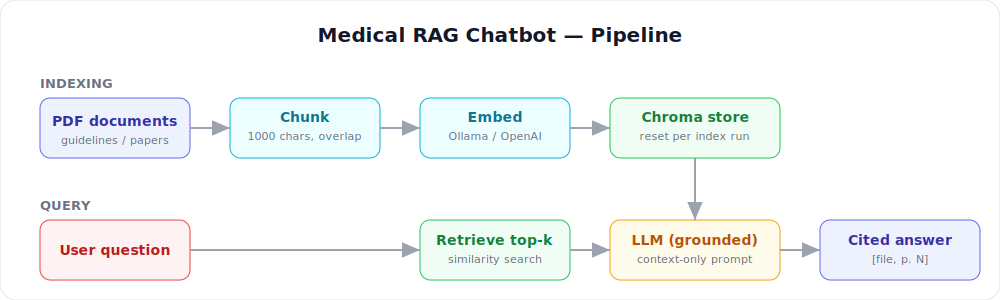

# G1Saathi

An Agentic AI Healthcare Information Assistant that answers questions about medical guidelines, clinical reports, and research papers, with **page-level citations for every claim**. Built with LangChain, Chroma, and Streamlit, with a **FastAPI** service for programmatic access — runs fully local by default with Ollama, or on OpenAI with a one-line change. Includes emergency safety screening, structured logging, and an intuitive dark healthcare UI.

   



## Why this matters

LLMs hallucinate. In healthcare that is unacceptable. G1Saathi answers **only** from the documents provided, screens for medical emergency language to prioritize human care, refuses to answer when the context does not contain the answer, and cites the exact file and page for every statement so users can verify the source.

## Features

- **Grounded, cited answers** — every claim carries a `[filename.pdf, p. 12]` citation, and the model refuses to answer outside the provided documents.
- **Safety screening** — real-time emergency and crisis language detection displaying immediate helpline guidance.
- **Document isolation** — each time you index, the store is rebuilt from exactly the PDFs you upload, so content from other documents can never leak into an answer.
- **Runs fully local** with open models via Ollama by default: free, no API key, and no document ever leaves your machine — ideal for sensitive clinical data.
- **Optional OpenAI mode** with a one-line `.env` change.
- **Scanned-PDF detection** — warns when an uploaded PDF has no extractable text and needs OCR.
- **Evaluation & Reliability Center** — automated test suite evaluating RAG pipeline, safety constraints, evidence coverage, and clinical accuracy directly in the UI.
- **Hackathon Demo Mode** — bypass rate limits and simulate evaluation workflows with synthetic data.
- **Clean Streamlit healthcare interface** with multi-page navigation (Ask, Medical Reports, Knowledge Sources, Evaluation, System), source-inspection panel, and retrieval match scores.

## Quickstart (local open models, default)

1. Install [Ollama](https://ollama.com) and pull the models:

```bash
ollama pull llama3.2
ollama pull nomic-embed-text
```

2. Run G1Saathi:

```bash
pip install -r requirements.txt
cp .env.example .env

python app.py
```
Open your browser at **http://127.0.0.1:5000**.

Then upload PDFs in the **Medical Reports** tab and click **Index Uploaded Reports** — or click **Load Sample Reports** to test immediately with the synthetic medical papers in [`examples/`](examples). (You can also index from the CLI: `python ingest.py --pdf-dir examples`.)

To use OpenAI instead, set `LLM_PROVIDER=openai` and `OPENAI_API_KEY` in `.env`. Note: if you switch provider after indexing, click **Clear index** (or delete `chroma_db/`) and re-index, because embeddings from different providers are not compatible.

## REST API (FastAPI)

The same ingest + retrieval core powers both the Streamlit app and an HTTP API, so any frontend or service can consume it:

```bash
uvicorn api:app --reload      # interactive Swagger docs at http://localhost:8000/docs
```

| Method | Endpoint | Purpose |
|---|---|---|
| `GET` | `/health` | Liveness check |
| `GET` | `/status` | Whether an index exists, and which files |
| `POST` | `/index` | Upload PDFs (multipart) and rebuild the index |
| `POST` | `/ask` | Ask a question → grounded, cited answer |
| `DELETE` | `/index` | Clear the index |

## How it works

1. PDFs are split into 1000-character chunks with overlap (`RecursiveCharacterTextSplitter`).
2. Chunks are embedded — locally with **nomic-embed-text** (Ollama) by default, or **OpenAI text-embedding-3-small** in OpenAI mode — and stored in Chroma.
3. Each time you index, the Chroma store is **reset** so it holds only your current documents.
4. At question time the top-k chunks are retrieved and passed to the LLM.
5. A strict system prompt forces grounded answers with `[file, p. N]` citations, and refuses when the answer is not in the retrieved context.

## Evaluation

Retrieval quality is measurable, not vibes. `eval.py` reports **Hit-rate@k** and **MRR@k** over a small labelled question set. Index the sample papers, then run it:

```bash
python ingest.py --pdf-dir examples
python eval.py --questions eval/questions.example.json --k 4
```

Each item maps a question to the file that should answer it (the included examples are pre-labelled against the two sample papers). Add your own Q→source pairs to track retrieval quality as you tune chunking or embeddings.

## Project structure

```
G1Saathi/
  app.py            Streamlit healthcare interface (dark theme, navigation, source inspector)
  safety.py         Safety screening (emergency & crisis language detection)
  logging_config.py Structured logging (console + rotating file)
  api.py            FastAPI service (same core as the Streamlit app)
  ingest.py         PDF loading, chunking, embedding into Chroma (index reset on each run)
  rag_chain.py      Retrieval chain with citation prompt
  models.py         Provider switch (Ollama / OpenAI)
  eval.py           Retrieval evaluation (Hit-rate@k, MRR@k)
  examples/         Two synthetic sample papers to try immediately
  data/uploads/     PDFs uploaded via the app (git-ignored)
  data/pdfs/        Optional: PDFs for CLI ingest
  chroma_db/        Vector store (created on first index; git-ignored)
  logs/             Application logs (git-ignored)
  docs/             Architecture diagram and screenshots
```

## Disclaimer

This tool is for information retrieval only. It does not provide medical advice, diagnosis, or treatment recommendations.

## License

MIT. Built by Hanshal Bobate.
